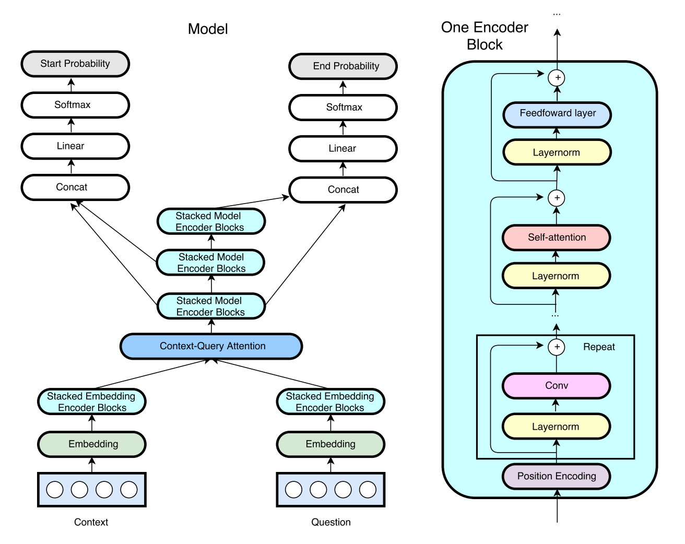

# Qanet

遵循通用的mrc框架模型，分为embedding，encoder, 交互层，预测层四部分

## 模型结构

### embeding层

word embedding  + char embedding + high way 网络（high way 网络是怎样的？，highay 网络）

### encoder层 

这里重点介绍下encoder block，这个blocker 和 transformer的encoder比较相似，位置编码 + CNN 网络（深度分离可卷积，因为CNN 只能捕获局部的相关信息，使用深度可分离卷积的目的是为了减少计算量）+ self attention（self attention 能够捕捉长距离的依赖关系），用来替代了bidaf中的lstm

### 交互层

context-question attention 层 +  3层 encoding block 层

 对 context 和 question得到的相关内容计算attention, 这里的交互层和BiDAF相似，都是计算Q2C和C2Q两部分，这一部分得到的两个向量后面进行concat，随后又经过了3层的刚才的blocker，第一层计算的结果？，第二层的结果用来计算起始的相关位置，第三层因为是在第二层的基础上，所以就会包含起始概率的相关信息

### 预测层

 这个概率计算的话就是 线性层，softmax 。

损失函数：和BiDAF是一样的（损失函数是开始和结束位置的交叉熵之和，这不是交叉熵之和吧？）

## 优点

CNN可以提取局部的信息，能够使用并行计算，self attention 能够高效的提取长序列的信息，相比与BiDAF 网络（仅使用LSTM），能很好的提高速度，使用encoder 使得效果也有所提升

